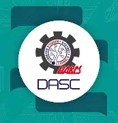

# Tareas y Trabajos — Programación Web 2026

  

  <strong>Repositorio académico de Programación Web</strong> 
  Tareas, ejercicios, prácticas y proyectos desarrollados durante el curso.

---

## Subtitulos

Este repositorio contiene una recopilación organizada de los trabajos realizados en clase y las tareas asignadas durante la materia de **Programación Web**, impartida por la profesora **Brenda Lara Rubio**.

El objetivo principal es mantener en un solo lugar los diferentes ejercicios, prácticas y proyectos desarrollados a lo largo del semestre, facilitando su consulta, seguimiento y organización durante el periodo académico.

### Información del estudiante

| Campo | Información |
|---|---|
| **Nombre** | Azarias Villanueva Collins |
| **Carrera** | Ingeniería en Desarrollo de Software |
| **Semestre** | Quinto |
| **Materia** | Programación Web |
| **Profesora** | Brenda Lara Rubio |
| **Periodo** | 2026 |

---

## Listas

### Tecnologías y lenguajes

- **HTML** — Estructuración y creación de contenido para páginas web.
- **JavaScript** — Desarrollo de funcionalidades e interactividad en los proyectos.

Estas son algunas de las principales tecnologías y lenguajes utilizados en los trabajos y actividades de la materia.

### Contenido del repositorio

- Ejercicios realizados durante las clases.
- Tareas asignadas durante el curso.
- Prácticas de desarrollo web.
- Proyectos desarrollados durante el semestre.
- Material académico relacionado con las actividades de la materia.

---

## Imagen

  

> Espacio destinado a imágenes representativas de los proyectos, prácticas o actividades desarrolladas durante la materia.

---

## Enlace

Repositorio oficial en GitHub:

**[Tareas y Trabajos — Programación Web 2026](https://github.com/azariasUABCS/Tareas-y-Trabajos---Programacion-Web-2026)**

En este repositorio se encuentran disponibles los trabajos y proyectos desarrollados durante el curso.

---

## Tabla

A continuación se presenta una tabla para organizar y consultar de manera clara los diferentes trabajos, tareas y proyectos incluidos en el repositorio.

| # | Actividad | Tecnología | Descripción | Estado |
|---:|---|---|---|---|
| 1 | Tarea / Proyecto | HTML | Actividad desarrollada durante el curso | En desarrollo |
| 2 | Tarea / Proyecto | JavaScript | Actividad desarrollada durante el curso | En desarrollo |
| 3 | Práctica | HTML / JavaScript | Práctica realizada en clase | En desarrollo |

> Esta tabla puede actualizarse conforme se incorporen nuevas tareas, prácticas y proyectos al repositorio.

---

  <strong>Programación Web · Ingeniería en Desarrollo de Software · Quinto Semestre</strong>

  Repositorio académico — Azarias Villanueva Collins · 2026

